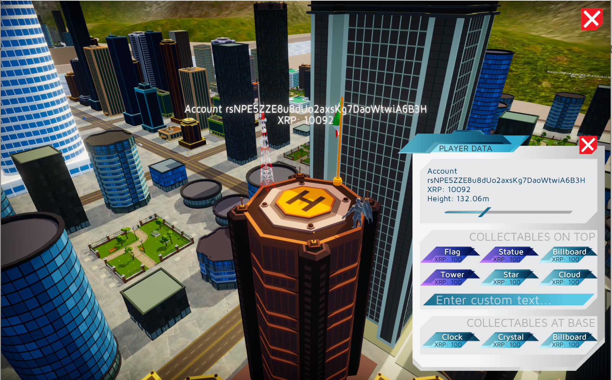
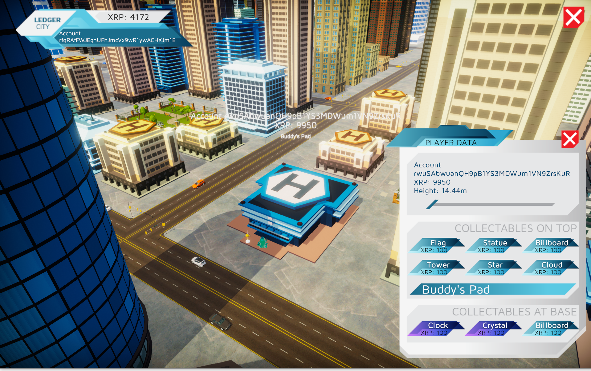
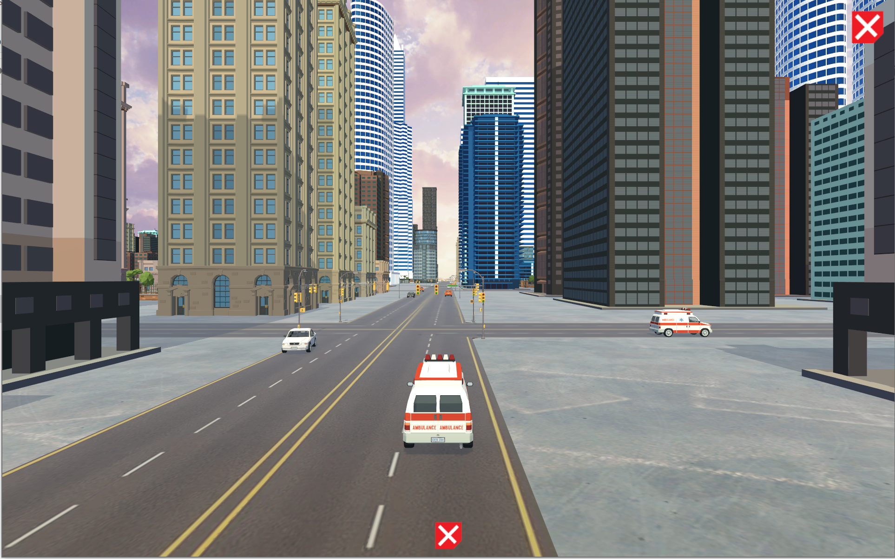

# Ledger City

Ledger City is a game based on the XRP blockchain where accounts are rendered as buildings in a 3D city whose heights are proportional to the balances held by the accounts.

Collectable assets (implemented as **NFTs**, able to be purchased from Dev Null Productions) can be purchased by account owners and placed on their buildings to customize and personalize their appearance.

**It's never been easier to visualize the XRP ledger!**

## About this project

This repo contains a prototype implementation of Ledger City with static content for demonstration purposes.

This prototype is based on the Unity game engine with custom graphical assets designed specifically for Ledger City.

Once completed, Ledger City will pull data from the live XRP blockchain and will be updated in real time as accounts are modified.

## Legalize

(C) 2021 Dev Null Productions

Released under the AGPLv2